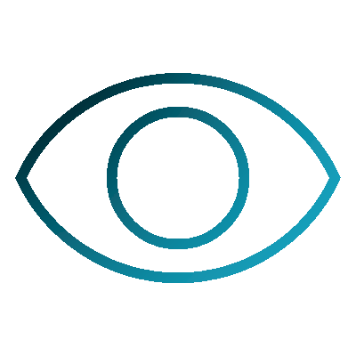

  

<h1 align="center">EduVision</h1>

  
  
  
  
  
  
  

  <b>C++ application designed for automated student attendance tracking</b>
    
  Developed as a part of my coursework, this project aims to simplify the process of recording and managing attendance data, making it efficient and error-free.
   
  

  
  

<h2>Model</h1>
